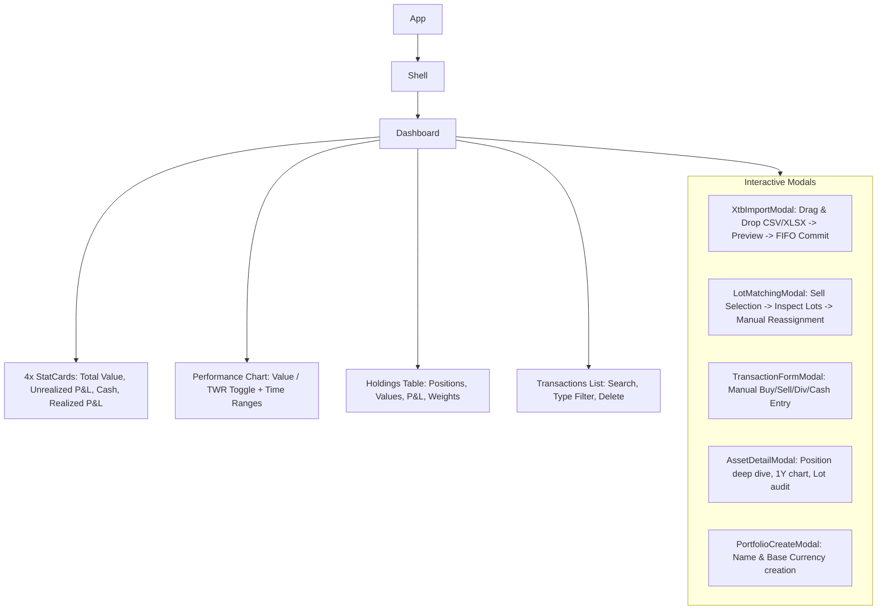

# Codebase Documentation: Folio (Aplikacja Finansowo-Inwestycyjna)

Token-optimized technical overview of the Folio investment portfolio tracking application.

---

## 1. System Overview & Tech Stack

- **Purpose**: Local-first personal investment portfolio tracker with multi-currency support, XTB statement parsing, automated FIFO / manual tax-lot matching, unrealized/realized P&L, and Time-Weighted Rate of Return (TWR) performance analytics.
- **Frontend Core**: React 18 (`react`, `react-dom`), TypeScript 5.5, Vite 5.4.
- **Styling**: Tailwind CSS 3.4 (`index.css`, `tailwind.config.js`), Lucide React icons.
- **Charts**: Recharts (`AreaChart`, `LineChart`).
- **Data Parsing**: SheetJS (`xlsx` v0.18.5) for Excel (`.xlsx`, `.xls`) and CSV parsing.
- **Storage / Backend**: Client-side `localStorage` (`folio-data-v1`) with full JSON backup/restore. (`@supabase/supabase-js` is included in dependencies for optional cloud backend expansion).
- **External Data**:
  - **Stooq CSV API**: Delayed quotes and historical daily prices.
  - **NBP Web API**: Official Polish National Bank FX rates (PLN conversions).

---

## 2. Project Directory Manifest

```
projekt1/
├── index.html                   # HTML entry point (title: "Folio — Portfolio Tracker")
├── vite.config.ts               # Vite configuration with path aliases (@/ -> src/)
├── tailwind.config.js           # Theme extensions (colors: primary, surface, success, warning, error)
├── docs/
│   └── codebase.md              # Token-efficient codebase documentation (this file)
└── src/
    ├── main.tsx                 # React entry point, mounts App inside React.StrictMode
    ├── App.tsx                  # Root shell with ThemeProvider, DataProvider, ToastProvider
    ├── index.css                # Global CSS, Tailwind directives, custom component utility classes
    ├── context/
    │   ├── DataContext.tsx      # Main application state, CRUD actions, localStorage persistence, JSON I/O
    │   └── ThemeContext.tsx     # Dark / light mode state & toggle (persisted in localStorage)
    ├── hooks/
    │   └── usePortfolioSummary.ts # Aggregates holdings, cost basis, unrealized/realized P&L, cash balances
    ├── lib/
    │   ├── types.ts             # All TypeScript interfaces, entities, and data models
    │   ├── portfolio.ts         # Portfolio math: lot computation, realized P&L, holdings, TWR snapshots
    │   ├── xtbImport.ts         # XTB statement parser (CSV/XLSX), venue/ticker normalizer, FIFO matching
    │   ├── marketData.ts        # Stooq price fetcher, NBP FX fetcher, fallback quotes, synthetic history
    │   ├── format.ts            # Formatting helpers: currency, numbers, percentages, dates, change classes
    │   └── sampleData.ts        # Seed data generator for initial demo / onboarding
    └── components/
        ├── Dashboard.tsx        # Top-level view: stats, charts, holdings table, actions, modal triggers
        ├── HoldingsTable.tsx    # Table of open positions with live value, P&L, allocations
        ├── TransactionsList.tsx # Filterable / searchable chronological transaction history
        ├── PerformanceChart.tsx # Recharts-based chart for Total Value and TWR % across 1M/6M/YTD/1Y/ALL
        ├── PortfolioCreateModal.tsx # Modal to create a new portfolio with custom base currency
        ├── TransactionFormModal.tsx # Modal to manually add BUY, SELL, DIVIDEND, CASH_IN, CASH_OUT
        ├── XtbImportModal.tsx   # Modal for drag-and-drop XTB import with preview and FIFO matches
        ├── LotMatchingModal.tsx # Modal for specific lot identification & manual sell-to-buy reassignment
        ├── AssetDetailModal.tsx # Position deep-dive: quote, 1Y price chart, open/closed lot breakdown
        └── ui/
            ├── Modal.tsx        # Reusable accessible dialog wrapper (backdrop, size presets)
            ├── StatCard.tsx     # Key financial metric card with delta badge & accent styling
            ├── Toast.tsx        # Toast alert component
            └── ToastContext.tsx # Toast notification hook (`useToast`) and provider
```

---

## 3. Core Data Models (`src/lib/types.ts`)

| Type / Interface | Key Fields | Description |
| :--- | :--- | :--- |
| `TransactionType` | `"BUY" \| "SELL" \| "DIVIDEND" \| "CASH_IN" \| "CASH_OUT"` | Supported financial operations |
| `Portfolio` | `id`, `name`, `base_currency`, `created_at` | Top-level portfolio container |
| `Asset` | `id`, `ticker`, `exchange`, `name`, `currency`, `type`, `created_at` | Financial instrument metadata (e.g. `AAPL`/`NASDAQ`/`USD`) |
| `Transaction` | `id`, `portfolio_id`, `asset_id`, `type`, `date`, `quantity`, `price`, `fee`, `currency`, `note`, `asset?` | Historical transaction record |
| `LotMatch` | `id`, `sell_transaction_id`, `buy_transaction_id`, `quantity`, `realized_pnl`, `method` (`"FIFO" \| "MANUAL"`), `created_at` | Pairing of a sell order against a buy lot |
| `Holding` | `asset`, `quantity`, `avgCost`, `costBasis`, `marketPrice`, `marketValue`, `marketValueBase`, `unrealizedPnl`, `unrealizedPnlPct`, `dayChange`, `dayChangePct`, `currency`, `allocationPct` | Aggregated active position for dashboard |
| `PortfolioSnapshot`| `date`, `totalValue`, `invested`, `twr` | Daily performance point for charts |
| `Quote` | `ticker`, `exchange`, `price`, `change`, `changePct`, `currency` | Current quote snapshot |
| `AppData` | `portfolios: Portfolio[]`, `assets: Asset[]`, `transactions: Transaction[]`, `lotMatches: LotMatch[]`, `version: number` | Serializable schema for `localStorage` & JSON backup |

---

## 4. Key Business Logic & Algorithms

### 4.1 Lot Computation & Realized P&L (`src/lib/portfolio.ts`)
- **`computeLots(transactions, lotMatches, assetId): Lot[]`**:
  1. Filters transactions for `assetId` into sorted `buys` and `sells` by date.
  2. Initialises open lots from `buys`.
  3. Applies explicit matches from `lotMatches` first (reduces `lot.remainingQuantity` and records `lot.matched`).
  4. For unmatched sell quantities, applies automated **FIFO** matching against remaining open lots where `buy.date <= sell.date`.
- **`realizedPnlForAsset(...)`**:
  Calculates `(effectiveSellPrice - effectiveBuyCost) * matchedQty`, incorporating transaction fees into cost basis.

### 4.2 Time-Weighted Return (TWR) (`src/lib/portfolio.ts`)
- **`computePortfolioSnapshots(transactions, priceHistory, baseCurrency, startDate, endDate): PortfolioSnapshot[]`**:
  - Iterates day-by-day over date range.
  - Accounts for daily cash inflows/outflows (`CASH_IN`, `CASH_OUT`) at the start of each day.
  - Formula: $\text{dailyReturn} = \frac{\text{marketValue} - \text{flow} - \text{prevValue}}{\text{prevValue}}$
  - Compounding: $\text{twr}_{t} = (1 + \text{twr}_{t-1}) \times (1 + \text{dailyReturn}) - 1$
  - Multiplies cumulative return by 100 for percentage representation.

### 4.3 Summary & Uninvested Cash (`src/hooks/usePortfolioSummary.ts`)
- **Uninvested Cash** formula in base currency:
  $$\text{Cash} = \sum \text{CASH\_IN} - \sum \text{CASH\_OUT} - \sum \text{BUY\_TOTALS} + \sum \text{SELL\_TOTALS} + \sum \text{DIVIDENDS}$$
- **Holdings Aggregation**: Iterates over unique assets with positive quantity, calculates average cost per remaining share, applies FX rates to base currency, and computes allocation percentages.

### 4.4 XTB Statement Parser (`src/lib/xtbImport.ts`)
- **`parseXtbFile(file: File): Promise<XtbParseResult>`**:
  - Reads workbook, detects transaction sheet (`trading|history|position|operation`).
  - Normalizes dynamic header keys across regional XTB export variants.
  - Filters out CFD, Forex, Crypto, Indices, Options, Futures.
  - Cleans tickers (e.g. `CDR.PL` -> `GPW`/`PLN`, `AAPL.US` -> `NASDAQ`/`USD`, `SAP.DE` -> `XETRA`/`EUR`).
- **`runFifoMatching(rows): FifoMatch[]`**:
  - Runs client-side FIFO matching across parsed trades for immediate preview before database commitment.

### 4.5 Market Data & FX Feed (`src/lib/marketData.ts`)
- **Stooq Feed**:
  - Quotes: `https://stooq.com/q/l/?s={sym}&f=sd2t2ohlcv&e=csv`
  - History: `https://stooq.com/q/d/l/?s={sym}&d1={start}&d2={end}&i=d`
- **NBP Currency API**:
  - `https://api.nbp.pl/api/exchangerates/rates/a/{currency}/{start}/{end}/?format=json`
- **Fallback / Simulation Engine**:
  - Includes static quotes (`FALLBACK_QUOTES`), static approximations (`fxApprox`), and deterministic pseudo-random market walk generator (`generateSyntheticHistory` via `mulberry32`) for offline demo usage.

---

## 5. State Management & Storage (`src/context/DataContext.tsx`)

- **Context Provider**: `DataProvider` wraps the entire app.
- **Storage Key**: `localStorage.getItem("folio-data-v1")`.
- **Auto-Initialization**: Loads sample portfolio data (`generateSampleData()`) on first run if local storage is empty.
- **CRUD Operations**:
  - Portfolios: `addPortfolio`, `deletePortfolio` (cascade-deletes transactions & matches).
  - Assets: `addAsset` (deduplicates by `ticker` + `exchange`).
  - Transactions: `addTransaction`, `deleteTransaction` (cascade-cleans associated matches).
  - Lot Matches: `addLotMatch`, `addLotMatches`, `deleteLotMatch`, `deleteLotMatchesForSell`.
  - Backup: `exportData` (triggers browser download of `folio-backup-YYYY-MM-DD.json`), `importData`, `clearAllData`, `loadSampleData`.

---

## 6. UI Structure & Modal Workflows



---

## 7. How to Extend / Maintenance Guide

1. **Adding a New Broker Statement Parser**:
   - Create a parser in `src/lib/<broker>Import.ts` following `XtbParseResult` and `ParsedXtbRow` interfaces.
   - Reuse `runFifoMatching()` from `src/lib/xtbImport.ts`.
   - Add a trigger button in `src/components/Dashboard.tsx` and a dedicated modal wrapper.

2. **Adding a Custom Quote / FX Provider**:
   - Implement query methods in `src/lib/marketData.ts` adhering to `Quote` and `PricePoint` types.
   - Adjust `fetchBulkHistory()` to route to the new provider with fallback to synthetic generators.

3. **Connecting a Remote Backend / Supabase**:
   - Replace or synchronize `persist()` inside `src/context/DataContext.tsx` with Supabase client RPCs or REST calls against tables mirroring `AppData` schema.
